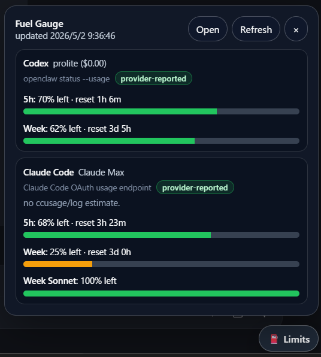

# OpenClaw Fuel Gauge PoC

Unofficial experimental OpenClaw Control UI “fuel gauge”: a manual refresh button that shows remaining provider capacity before starting expensive agent work.



## Why

Before launching a costly agent run, it is useful to know whether the current provider window is almost full, comfortably available, or about to reset. This PoC explores a small UI/API shape for showing that information without spending LLM tokens and without background polling.

This is an unofficial/reference implementation. It may be useful as a standalone experimental plugin, or as design material for an eventual OpenClaw core feature. If OpenClaw core or another contributor adopts, redesigns, or replaces this idea, that is very welcome.

## What it provides

- Gateway-authenticated plugin routes:
  - `/openclaw-fuel-gauge.json` — JSON snapshot.
  - `/openclaw-fuel-gauge/` — standalone mini panel.
  - `/openclaw-fuel-gauge.user.js` — userscript loader for the Control UI.
  - `/openclaw-fuel-gauge.bookmarklet` — bookmarklet helper page.
- Local collectors:
  - OpenClaw provider usage from `openclaw status --usage --json`.
  - Claude Code usage from Claude Code's OAuth usage endpoint.
- UI surfaces:
  - Standalone mini panel.
  - Control UI userscript/client overlay with a manual `⛽ Limits` button.
  - Optional unpacked browser extension for a configurable local overlay.

## Design goals

- Do not modify OpenClaw core files or `dist/control-ui`.
- Do not spend LLM tokens just to check capacity.
- Use a manual Refresh button instead of background polling.
- Label every data source and confidence level.
- Use provider-reported remaining-limit data where available.
- Keep environment-specific values configurable.

## Install from a local checkout

```bash
git clone https://github.com/lencon14/openclaw-fuel-gauge-poc.git
cd openclaw-fuel-gauge-poc
openclaw plugins install "$PWD"
```

Loading or reloading plugin code may require a Gateway restart. Do not restart casually on a live setup; get explicit operator approval first.

Then open:

- `https://<your-openclaw-host>/openclaw-fuel-gauge/`
- `https://<your-openclaw-host>/openclaw-fuel-gauge.user.js`
- `https://<your-openclaw-host>/openclaw-fuel-gauge.bookmarklet`

## Optional browser extension

An unpacked Chrome/Edge extension is included under [`extension/`](extension/). It is a local UI layer only:

- click the extension icon to inject the overlay into the active OpenClaw tab;
- no host permissions;
- no background polling;
- does not read provider credentials;
- fetches `<routePrefix>.json` from the current OpenClaw page origin.

To try it locally:

1. Open `chrome://extensions` or `edge://extensions`.
2. Enable **Developer mode**.
3. Click **Load unpacked**.
4. Select the `extension/` folder.
5. Open the OpenClaw Control UI and click the extension icon.

The extension options page supports route prefix, button position, compact mode, provider filter, window filter, and optional refresh-on-open.

## Privacy and safety notes

- This plugin does not send credentials to the browser or return them from its JSON route.
- Claude Code limits are fetched from Claude Code's OAuth usage endpoint using local Claude credentials.
- OpenClaw limits are fetched through `openclaw status --usage --json`.
- All exposed plugin routes are Gateway-authenticated.
- Refresh is manual; there is no background polling.
- Do not use Claude Code statusLine hooks or caches as a data source. User environments differ, and this plugin should not require modifying Claude Code settings.

### Audit note

OpenClaw's plugin security audit may flag this PoC because it reads local Claude OAuth credentials and performs a network request to Anthropic's OAuth usage endpoint. That access is intentional for the `claude-code` collector. The plugin must not send credentials anywhere else, and it must never expose credential values in route responses or UI output.

## Data-source labels

Every provider card should show both:

- `source` — where the displayed limits came from.
- `confidence` — how trustworthy the value is.

Current confidence labels:

- `provider-reported` — reported by a provider-facing status/limits source.

Claude Code is considered a first-class source for this PoC. Its source is Claude Code's OAuth usage endpoint. Do not use Claude Code statusLine caches as a data source; statusLine configuration is environment-specific and should not be required or modified by this plugin.

Remaining bars use simple thresholds:

- `>= 50% left` — green.
- `20–49% left` — yellow/orange.
- `< 20% left` — red.

## Config knobs

Plugin config supports:

```json5
{
  "routePrefix": "/openclaw-fuel-gauge",
  "collectors": ["openclaw", "claude-code"],
  "timezone": "",   // empty = system timezone
  "locale": "",     // empty = system locale
  "commands": {
    "openclawBin": "openclaw",
    "claudeCredentialsPath": "~/.claude/.credentials.json",
    "claudeUsageEndpoint": "https://api.anthropic.com/api/oauth/usage",
    "timeoutMs": 45000
  }
}
```

Environment variables with the `OPENCLAW_FUEL_GAUGE_` prefix can override the same basics for local testing, for example:

```bash
OPENCLAW_FUEL_GAUGE_TIMEZONE=<IANA_TIMEZONE> npm run smoke
OPENCLAW_FUEL_GAUGE_COLLECTORS=openclaw npm run smoke
OPENCLAW_FUEL_GAUGE_CLAUDE_CREDENTIALS=/path/to/.credentials.json npm run smoke
OPENCLAW_FUEL_GAUGE_CLAUDE_USAGE_ENDPOINT=https://api.anthropic.com/api/oauth/usage npm run smoke
```

## Development

```bash
npm run check
npm run smoke
npm run test:extension
```

The smoke test prints a JSON snapshot and should include `source` and `confidence` fields for every provider. The extension smoke test launches a temporary Chromium page through the Chrome DevTools Protocol, injects the overlay, fetches a fixture fuel-gauge JSON route, verifies rendered provider/source/confidence data, and writes a screenshot to `.tmp/extension-smoke.png`.

## Known limitations

- Experimental PoC; no maintenance promise yet.
- The userscript/bookmarklet/browser-extension overlays are prototypes, not first-class Control UI extension points.
- Claude Code usage depends on Claude Code OAuth credentials and the OAuth usage endpoint.
- Provider coverage depends on provider-reported remaining-limit data being available.

## Status

Experimental PoC. Public feedback is welcome, especially on the API shape, UI placement, and provider data model.
